Bending as Optimization Criterion
=================================

Problem with the existing target function
-----------------------------------------
In some configurations, the puck based optimization has no global optimum at the lowest possible angle altough a layer up
to the fitting would be beneficial. The actual process has few layers up to the fitting.

An example is listed below in :ref:`problem_conf`
Examplary in layer 18, the maxPuck func looks like this:

|probconfpuck|

Next two images: The max puck fibre failure (hence stresses) at layer 18 when using a 67deg layer is lower than using 6.5deg since
the additional layer attracts load and thus stresses. On the other hand bending is reduced dastically.

|probconf_stress_strain_large_last_angle|
|probconf_stress_strain_small_last_angle|

Bending and Puck
----------------
Using :ref:`test_conf` with weights 1:puck and 0.5:bending. Interestingly, puck and bending values have little similarity

In this example, the bending criterion tends to include min angles
|testconf6|

In this example, the puck criterion tends to include min angles
|testconf8|

Comparison of different target function weights
-----------------------------------------------

+---------------+-------------+----------------+------------------+
| Configuration | Puck Weight | Bending weight | Number of layers |
+===============+=============+================+==================+
| Test Conf     | 1           | 0              | 71               |
+---------------+-------------+----------------+------------------+
| Test Conf     | 0           | 1              | 70               |
+---------------+-------------+----------------+------------------+
| Test Conf     | 1           | 0.5            | 70               |
+---------------+-------------+----------------+------------------+
| Problem Conf  | 1           | 0              | 31               |
+---------------+-------------+----------------+------------------+
| Problem Conf  | 0           | 1              | 33               |
+---------------+-------------+----------------+------------------+
| Problem Conf  | 1           | 0.5            | 31               |
+---------------+-------------+----------------+------------------+

Test Conf     , puck 1           , bending 0

|layuptestconf_p1_b0|

Test Conf     , puck 0           , bending 1

|layuptestconf_p0_b1|

Test Conf     , puck 1           , bending 0.5

|layuptestconf_p1_b05|

Problem Conf  , puck 1           , bending 0

|layupprobconf_p1_b0|

Problem Conf  , puck 0           , bending 1

|layupprobconf_p0_b1|

Problem Conf  , puck 1           , bending 0.5

|layupprobconf_p1_b05|

Configurations
--------------

.. _problem_conf:

Problem Conf
~~~~~~~~~~~~
DOE variant of vphDesign1_isotensoid: Changed pressure, diameter, cylindrical length

Input

- windingOrMetal         | winding
- tankname               | vph_design1_iff_sf2.25
- nodeNumber             | 500
- verbose                | False
- verbosePlot            | True
- maxLayers              | 100
- relRadiusHoopLayerEnd  | 0.95
- targetFuncWeights      | [1.0, 0.25, 2.0, 0.1]
- dcyl                   | 2620.0
- lcylByR                | 2.487
- volume                 | None
- domeType               | isotensoid_MuWind
- domeContour            | [[   0.        ,  66.54      , 132.39      , 196.9       , 259.46      , 319.5       , 376.54      , 430.17      , 480.06      , 525.98      , 567.79      , 605.42      , 638.9       , 668.31      , 693.78      , 715.52      , 733.76      , 748.75      , 760.81      , 770.23      , 777.34      , 782.48      , 785.99      , 788.24      , 790.48589565], [1310.        ,1306.62727782,1296.56302253,1279.96077911,1257.06486099,1228.20846631,1193.78585699,1154.24833931,1110.09066641,1061.81998799,1009.94245843, 954.97059864, 897.35986736, 837.55648804, 775.99539874, 712.99812688, 648.88276141, 583.98878195, 518.41481887, 452.44098736, 386.19067523, 319.71504115, 253.15518341, 186.51681227, 120.        ]]
- polarOpeningRadius     | 120
- alpha                  | 0.5
- beta                   | 1.5
- gamma                  | 0.5
- delta1                 | 0.5
- dome2Type              | None
- dome2Contour           | (None, None)
- dome2LengthByR         | 0.5
- safetyFactor           | 2
- valveReleaseFactor     | 1.1
- h2Mass                 | None
- temperature            | 23
- pressure               | 0.874
- minPressure            | 0.1
- maxFill                | 0.9
- useHydrostaticPressure | False
- tankLocation           | wing_at_engine
- initialAnglesAndShifts | None
- materialName           | CFRP_HyMod
- failureMode            | interFibreFailure
- layerThk               | 0.125
- layerThkHoop           | 0.125
- layerThkHelical        | 0.125
- rovingWidth            | 3.175
- rovingWidthHoop        | 3.175
- rovingWidthHelical     | 3.175
- numberOfRovings        | 12
- tex                    | 446
- fibreDensity           | 1.78
- linerThickness         | 0.5
- insulationThickness    | 127
- fairingThickness       | 0.5
- runDir                 | C:\PycharmProjects\tankoh2\tmp\doe_exact_cyl_isotensoid_20221205_231610\tmp_20221206_065948_428837
- lcyl                   | 3257.9700000000003
- dome2                  | None
- dome                   | <tankoh2.geometry.dome.DomeGeneric object at 0x000001BD80034C40>
- tankLength             | 4838.941791290644
- burstPressure          | 1.9228

OUTPUTS

- Output Name       | unit | value
- shellMass         | kg   | 1433.6903177643208
- liner mass        | kg   | 32.79852731485748
- insulation mass   | kg   | 210.28849786098792
- fairing mass      | kg   | 36.22049753147644
- total mass        | kg   | 1712.9978404716426
- volume            | dm^3 | 23729.98902188117
- area              | m^2  | 43.68007368606773
- length axial      | mm   | 4838.941792
- numberOfLayers    |      | 100
- reserve factor    |      | 0.4135496984684569
- gravimetric index |      | 0.3978035018730327
- stress ratio      |      | 0.3338223762136822
- iterations        |      | 16098
- duration          | s    | 1:44:34.923893
- angles            | °    | [ 6.085,90.   ,11.75 ,90.   ,90.   ,90.   ,16.125, 9.875,90.   ,90.   ,90.   ,90.   ,13.759,14.756,67.923,67.923,67.192,67.197,67.263,67.206,67.211,67.224,67.243,67.26 ,67.923,67.923,67.809,67.922,67.818,67.922,67.827,67.831,67.836,67.84 ,67.845,67.849,67.569,67.858,67.862,67.867,67.871,67.876,67.88 ,67.884,67.889,67.893,67.898,67.902,67.906,67.911,67.921,67.92 ,67.356,67.417,67.365,67.37 ,67.374,67.379,67.383,67.417,67.417,67.397,67.401,67.406,67.41 ,67.698,69.391,69.395,67.144,67.149,67.153,67.167,67.188,67.222,67.172,67.221,67.22 ,67.218,67.246,67.244,67.258,67.258,67.258,67.212,67.219,67.258,67.258,67.23 ,67.258,67.239,67.244,67.258,67.253,67.821,67.826,67.83 ,67.835,67.839,67.862,67.862]
- hoopLayerShifts   | mm   | [ 0.   ,59.08 , 0.   , 5.945, 1.37 , 0.762, 0.   , 0.   , 1.37 ,13.559,13.466,28.656, 0.   , 0.   , 0.   , 0.   , 0.   , 0.   , 0.   , 0.   , 0.   , 0.   , 0.   , 0.   , 0.   , 0.   , 0.   , 0.   , 0.   , 0.   , 0.   , 0.   , 0.   , 0.   , 0.   , 0.   , 0.   , 0.   , 0.   , 0.   , 0.   , 0.   , 0.   , 0.   , 0.   , 0.   , 0.   , 0.   , 0.   , 0.   , 0.   , 0.   , 0.   , 0.   , 0.   , 0.   , 0.   , 0.   , 0.   , 0.   , 0.   , 0.   , 0.   , 0.   , 0.   , 0.   , 0.   , 0.   , 0.   , 0.   , 0.   , 0.   , 0.   , 0.   , 0.   , 0.   , 0.   , 0.   , 0.   , 0.   , 0.   , 0.   , 0.   , 0.   , 0.   , 0.   , 0.   , 0.   , 0.   , 0.   , 0.   , 0.   , 0.   , 0.   , 0.   , 0.   , 0.   , 0.   , 0.   , 0.   ]

.. _test_conf:

Test Conf
~~~~~~~~~
From existingdesigns.atheat3

INPUTS

- windingOrMetal         | winding
- tankname               | atheat_He
- nodeNumber             | 500
- verbose                | False
- verbosePlot            | True
- maxLayers              | 100
- relRadiusHoopLayerEnd  | 0.98
- targetFuncWeights      | [1.0, 0.0, 0.0, 0.0, 0.5]
- dcyl                   | 370
- lcyl                   | 197.14776274760035
- volume                 | 0.037
- domeType               | isotensoid_MuWind
- domeContour            | [[  0.        ,  9.16      , 18.23      , 27.12      , 35.76      , 44.07      , 51.99      , 59.46      , 66.44      , 72.9       , 78.81      , 84.17      , 88.97      , 93.23      , 96.95      ,100.16      ,102.89      ,105.18      ,107.05      ,108.55      ,109.73      ,110.61      ,111.26      ,111.73      ,112.18316848], [185.        ,184.54910957,183.20332306,180.98380676,177.91943254,174.05401479,169.43605461,164.12651857,158.18581975,151.67635576,144.67367368,137.23033019,129.42158334,121.28528096,112.90648629,104.32299288, 95.57487853, 86.66955107, 77.70615037, 68.6734264 , 59.51822133, 50.46428242, 41.30392791, 31.98510225, 23.        ]]
- polarOpeningRadius     | 23
- alpha                  | 0.5
- beta                   | 1.5
- gamma                  | 0.5
- delta1                 | 0.5
- dome2Type              | None
- dome2Contour           | (None, None)
- dome2LengthByR         | 0.5
- safetyFactor           | 2.0
- valveReleaseFactor     | 1.1
- h2Mass                 | None
- temperature            | 293
- pressure               | 60
- minPressure            | 0.1
- maxFill                | 0.9
- useHydrostaticPressure | False
- tankLocation           | wing_at_engine
- initialAnglesAndShifts | None
- materialName           | CFRP_HyMod
- failureMode            | fibreFailure
- layerThk               | 0.125
- layerThkHoop           | 0.125
- layerThkHelical        | 0.125
- rovingWidth            | 3.175
- rovingWidthHoop        | 3.175
- rovingWidthHelical     | 3.175
- numberOfRovings        | 4
- tex                    | 446
- fibreDensity           | 1.78
- linerThickness         | 3
- insulationThickness    | 0.0
- fairingThickness       | 0.0
- runDir                 | C:\PycharmProjects\tankoh2\tmp\tank_20221216_213626_atheat_He
- dome2                  | None
- dome                   | <tankoh2.geometry.dome.DomeGeneric object at 0x000001DF4D12C8E0>
- tankLength             | 421.5140997061768
- burstPressure          | 132.0

OUTPUTS

- Output Name        | unit | value
- shellMass          | kg   | 14.86701227942169
- liner mass         | kg   | 2.5162647833934835
- insulation mass    | kg   | 0.0
- fairing mass       | kg   | 0.0
- total mass         | kg   | 17.383277062815175
- volume             | dm^3 | 37.0
- area               | m^2  | 0.5644331911712522
- length axial       | mm   | 421.514099
- numberOfLayers     |      | 70
- reserve factor     |      | 1.004434669630684
- gravimetric index  |      | 0.07056319503638933
- stress ratio       |      | 0.4068122154760636
- hoop helical ratio |      | 0.8918918918918919
- iterations         |      | 3954
- duration           | s    | 0:58:27.774123
- angles             | °    | [ 9.072,90.   ,16.706,90.   ,90.   ,35.066, 9.757,90.   ,23.439,90.   ,11.59 ,90.   ,14.   ,90.   ,10.167,90.   ,43.492,17.273,90.   ,90.   ,27.216,14.015,90.   ,90.   ,13.979,90.   ,34.747, 9.974,90.   ,17.945,90.   ,45.857,90.   ,31.145,90.   ,33.763, 9.838,16.68 ,90.   ,90.   ,34.221,90.   ,15.855,90.   ,39.774,90.   ,27.193,16.68 ,90.   ,90.   ,23.823,51.908,16.704,90.   ,90.   ,30.849,11.918,18.227,90.   ,90.   ,10.099,21.629,90.   ,90.   ,30.11 ,90.   ,26.268,90.   ,26.203,90.   ]
- hoopLayerShifts    | mm   | [ 0.   ,25.738, 0.   ,24.958,24.178, 0.   , 0.   ,23.398, 0.   ,22.618, 0.   ,21.838, 0.   ,21.058, 0.   ,20.278, 0.   , 0.   ,19.498,18.719, 0.   , 0.   ,17.939,17.159, 0.   ,16.379, 0.   , 0.   ,15.599, 0.   ,14.819, 0.   ,14.039, 0.   ,13.259, 0.   , 0.   , 0.   ,12.479,11.699, 0.   ,10.919, 0.   ,10.139, 0.   , 9.359, 0.   , 0.   , 8.579, 7.799, 0.   , 0.   , 0.   , 7.019, 6.24 , 0.   , 0.   , 0.   , 5.46 , 4.68 , 0.   , 0.   , 3.9  , 3.12 , 0.   , 2.34 , 0.   , 1.56 , 0.   , 0.78 ]

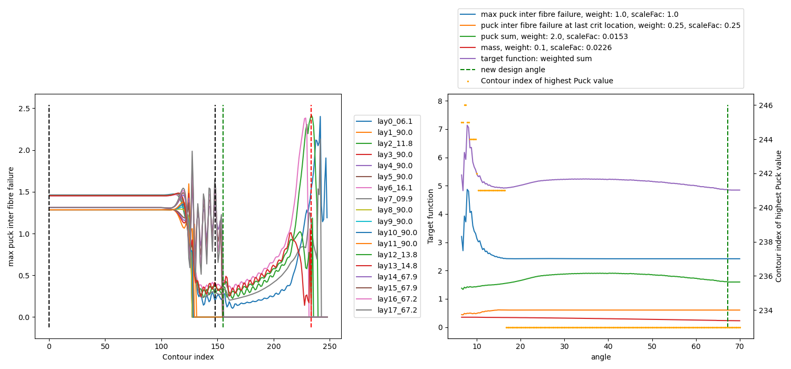
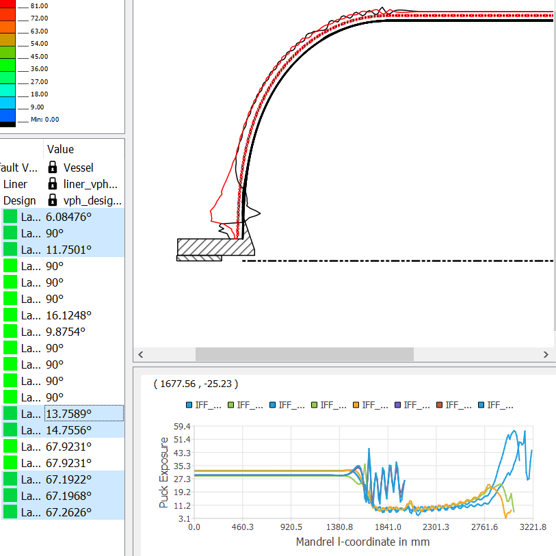
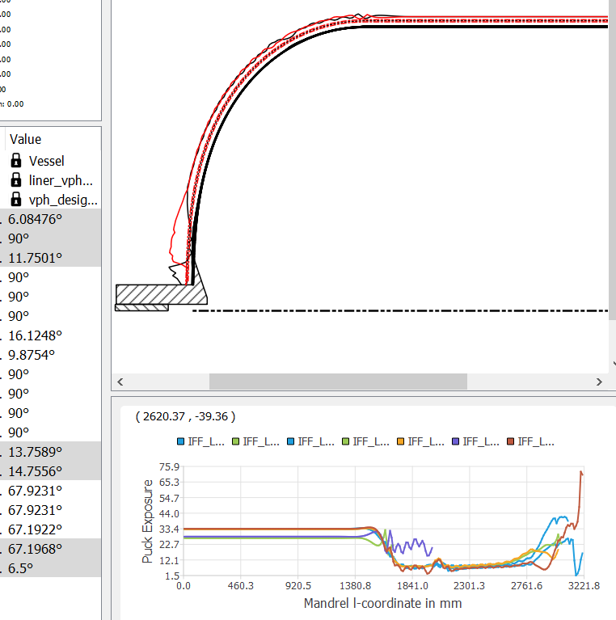
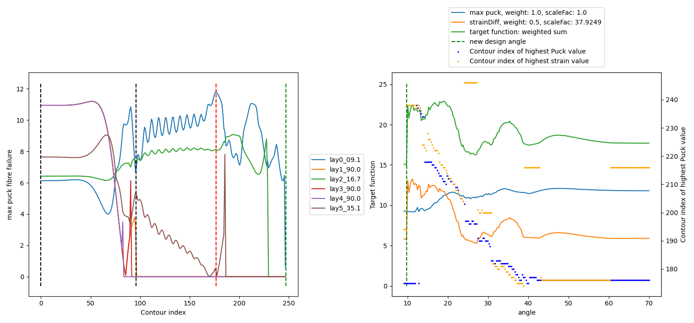
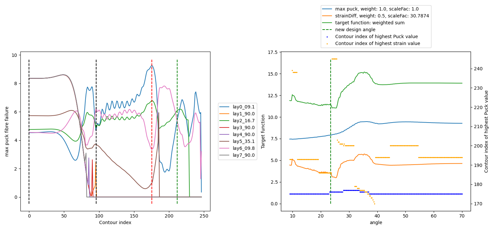
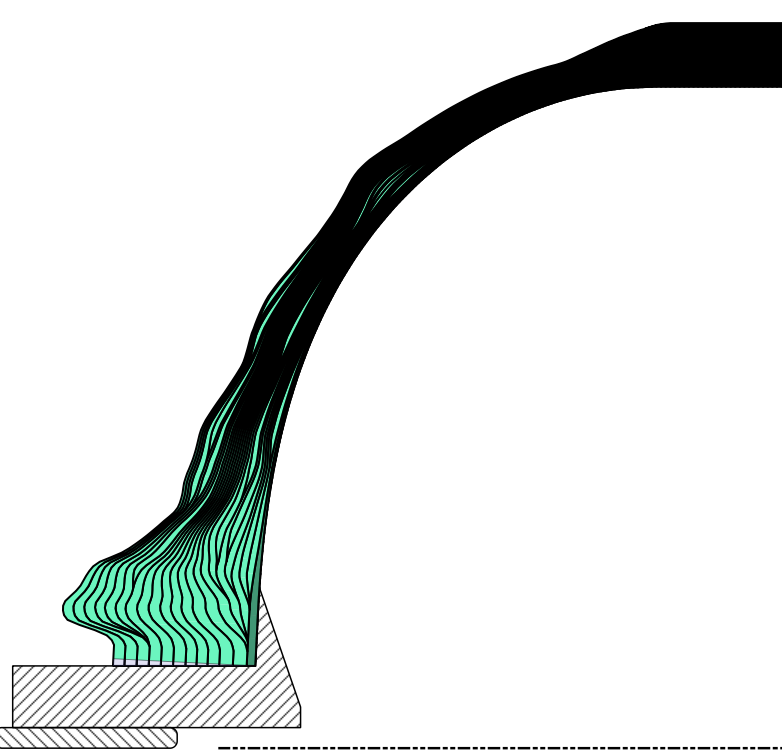
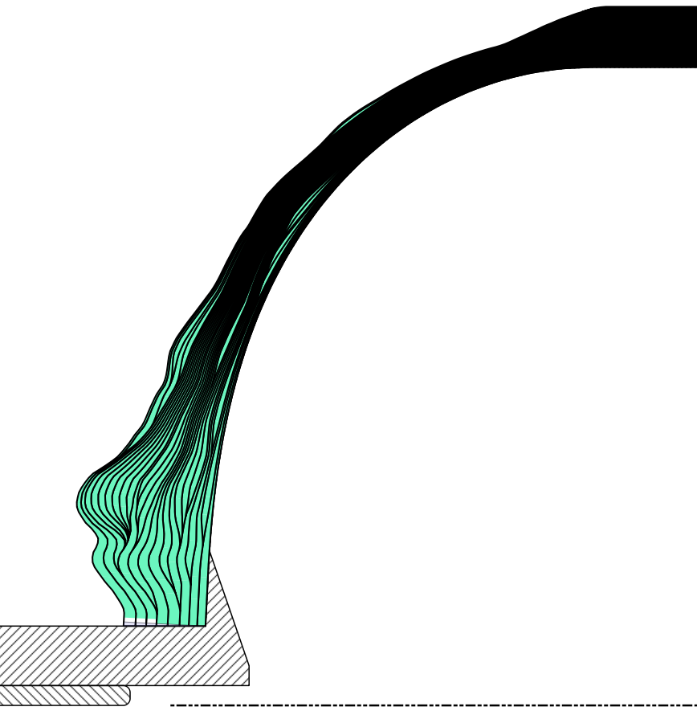
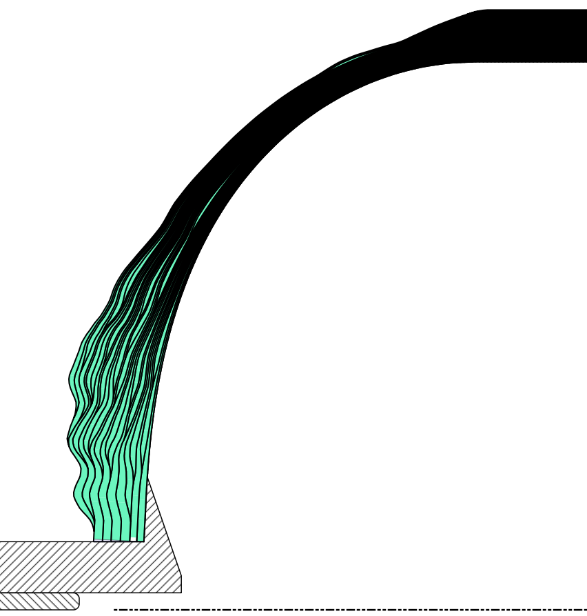
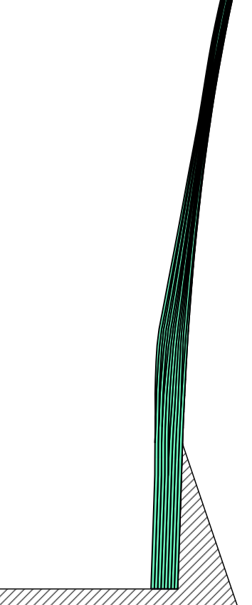
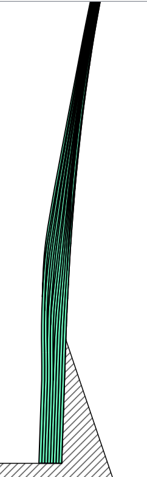
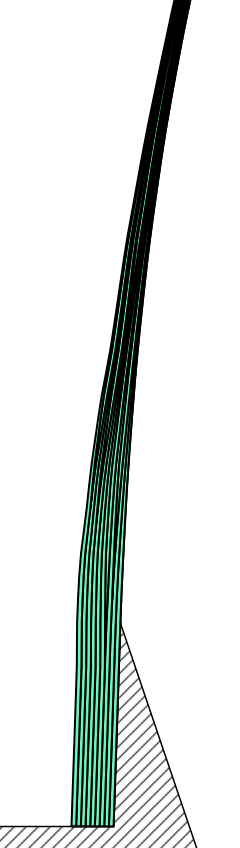
