# Optimization Function

There are various variants for the actual layer-based optimization in tankoh2. All tested variants are described here.

Goal of a target function:
- have a good balance between minimizing the last maximum and minimizing puck at all elements

## Use-Case
Used *conicalTankDesign* which is this geometry:

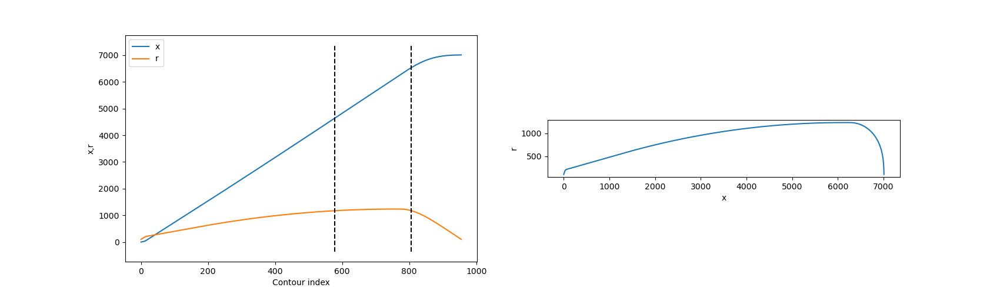

## $min(max(Puck))$
This is the most basic approach: Minimize the maximal puck value in all elements and all layers.

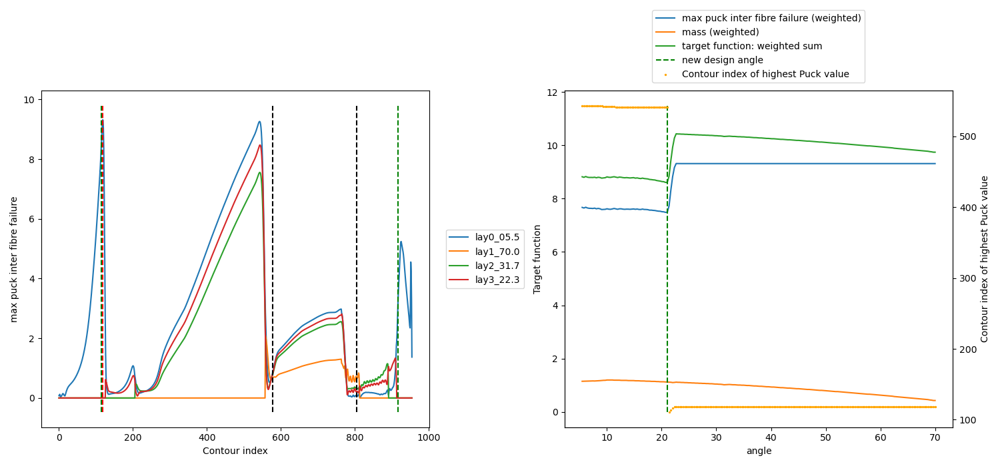
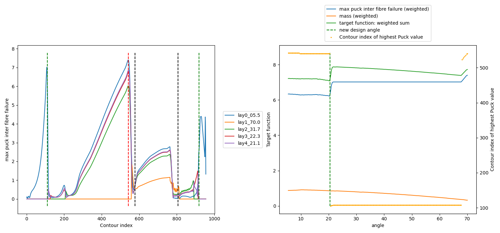
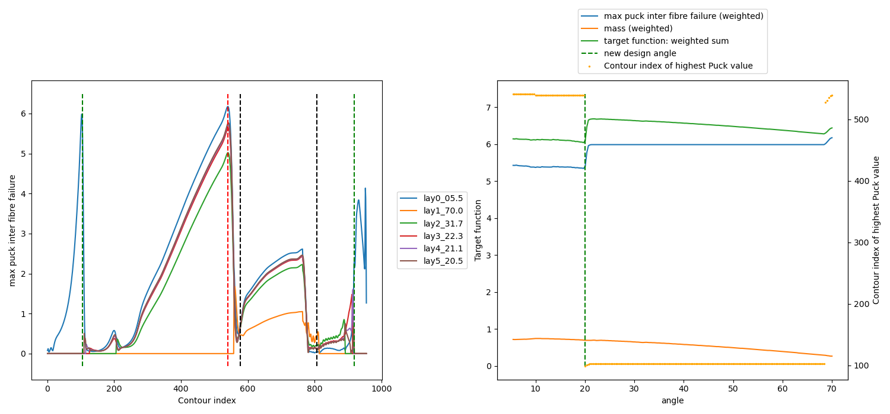
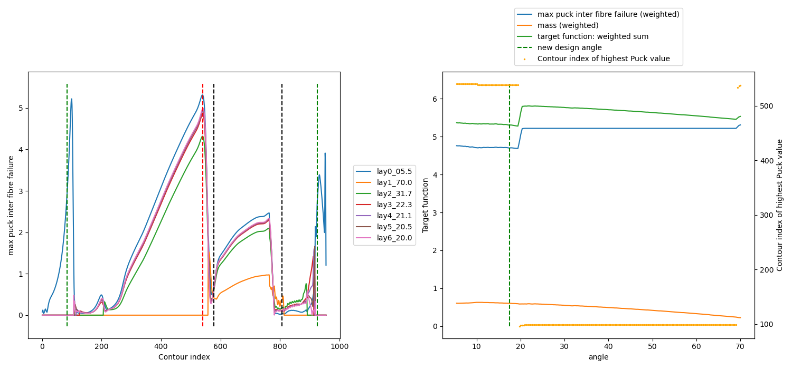

Con: This approach minimizes the whole dome region (or hoop region in hoop case) but does not find the optimium to work on one peak at a time. As seen in the images, this produces a ping-pong like behavior. It minimizes both, but not one peak properly at a time.

In example "conicalTankDesign" (commit bb76384) this method resulted in >22 layers

## $min(max(Puck(crit index)))$
This approach minimizes the puck value at the very exact peak of the last iteration. 

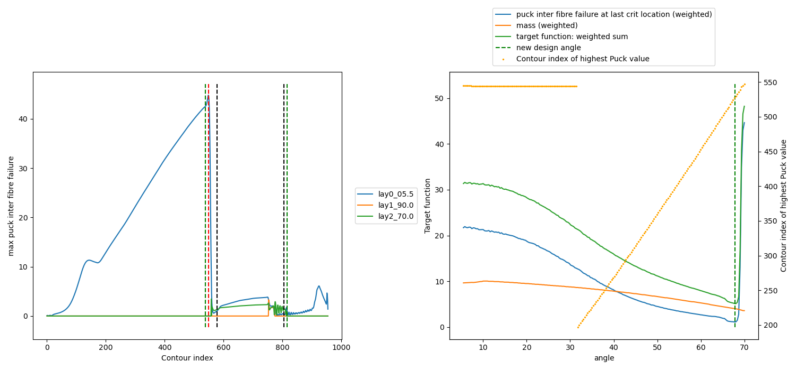
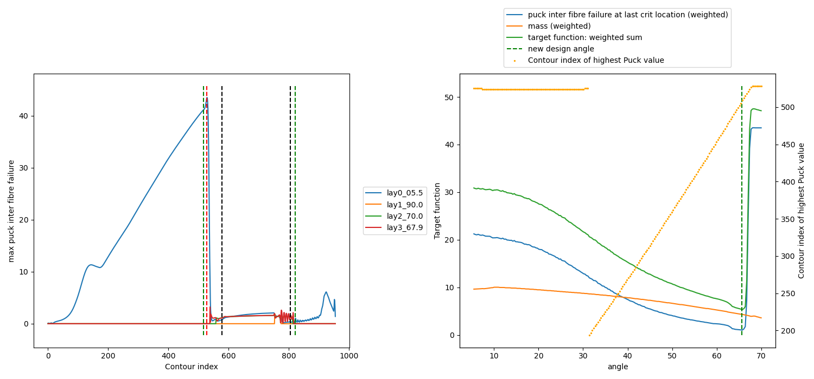
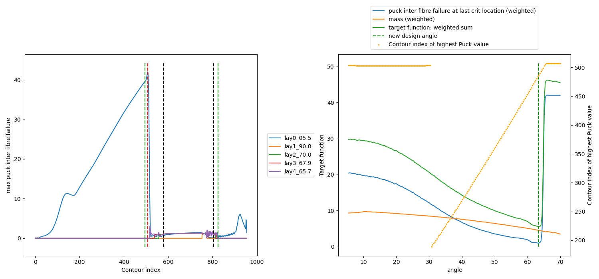

con: the next peak may be right next to the last one. So a target function that incorporates the total maximum or the neighborhood of the
last critial location might be beneficial

In example "conicalTankDesign" (commit bb76384) this method resulted in >22 layers

## Weighted $min(max(Puck))$ and $min(max(Puck(crit index)))$
see [issue 60](https://github.com/sfreund-DLR/tankoh2/issues/60)

Due to the problems with both singular methods before, they are combined in a weighted sum in order to incorporate both effects: 
local minimization and a global minimization. Also a mass function was added as side kick ;-)

These Weights $\omega$ are used:
- 1 Min(Max(Puck))
- 0.5 Min(Max(Puck(crit index)))
- 0.1 next Layer Mass

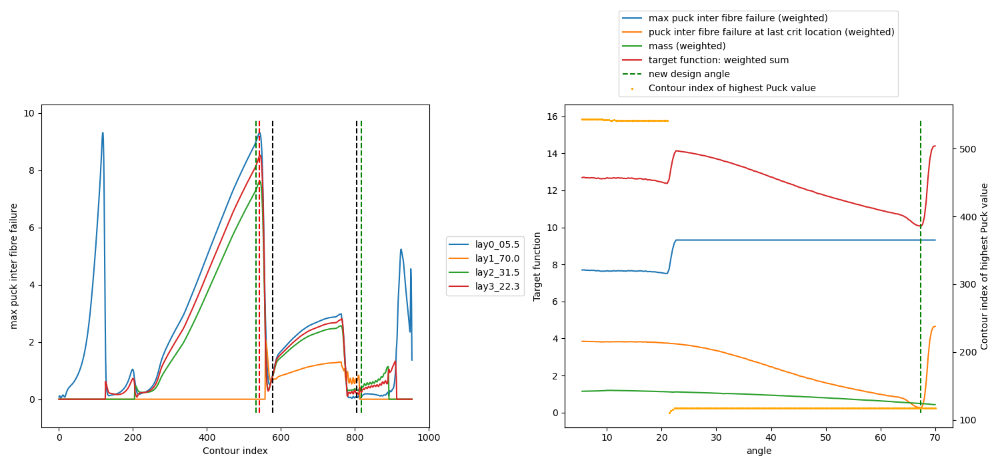
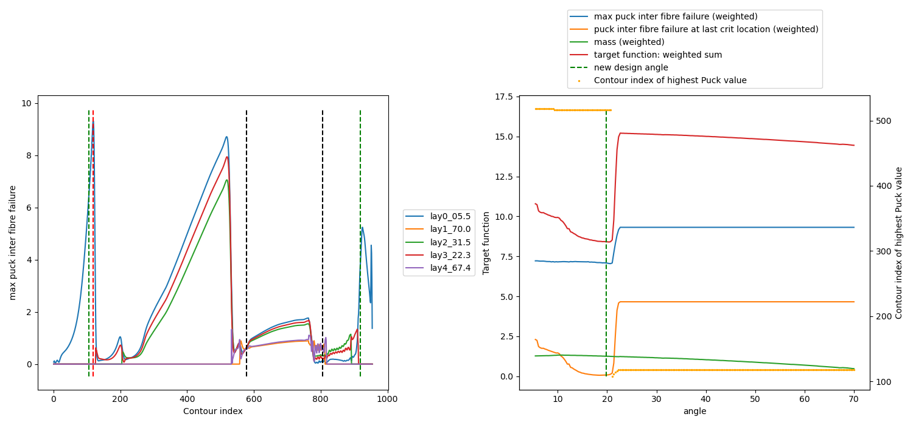
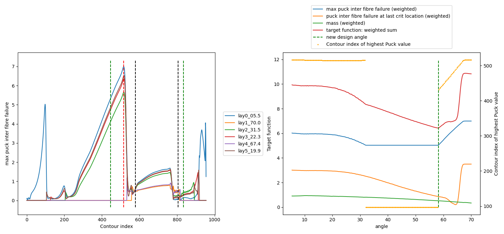

It improves the above behavior as seen in third image but still does very local changes as seen in the first and second image

In example "conicalTankDesign" (commit bb76384) this method resulted in 14 layers

## Integral func $min(\sum puck)$
When using $min(\sum puck)$ instead of $min(max(Puck))$, the whole material utilization is taken into account for minimization. This might be a good combination with $min(max(Puck(crit index)))$.

**Weights Calculation**
The initial weights $\omega$ and the target function values of the last iteration $\bar{y}$ are used
to derive scaling factors $\lambda$ for the following iteration:

$\lambda = \omega / \bar{y} \cdot y_{i, y_i \neq 0}$

$y_{i, y_i \neq 0}$ is used to scale the values to the amount of the first quantity, which is not zero. 
With this, $\omega[0] == 1$ lead to comparable puck values of $min(max(Puck))$.

**Results**

These weights are compared:

- old version (see above chapter) $\omega_{old} = [1,1,0,0.1]$
- new version $\omega_{V1} = [1,1,1,0.1]$
- new version $\omega_{V2} = [1,0.5,2,0.1]$

### Iteration 3
The result after 3 layers is nearly equal:

3 layers done: $\omega_{old} = [1,1,0,0.1]$
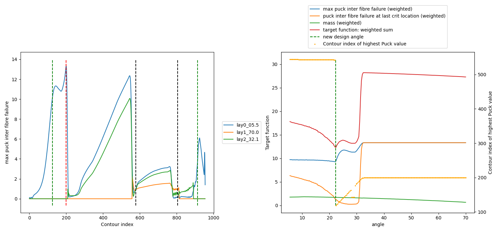
3 layers done: $\omega_{V1} = [1,1,1,0.1]$

3 layers done: $\omega_{V2} = [1,0.5,2,0.1]$
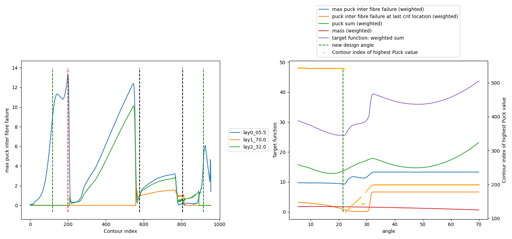

### Iteration 4
Here, the old approach $\omega_{old} = [1,1,0,0.1]$, uses only a small offset between max value and next angle
polar opening. The new approach minimizes a larger range between maximum utilization and next angle polar opening.

4 layers done: $\omega_{old} = [1,1,0,0.1]$
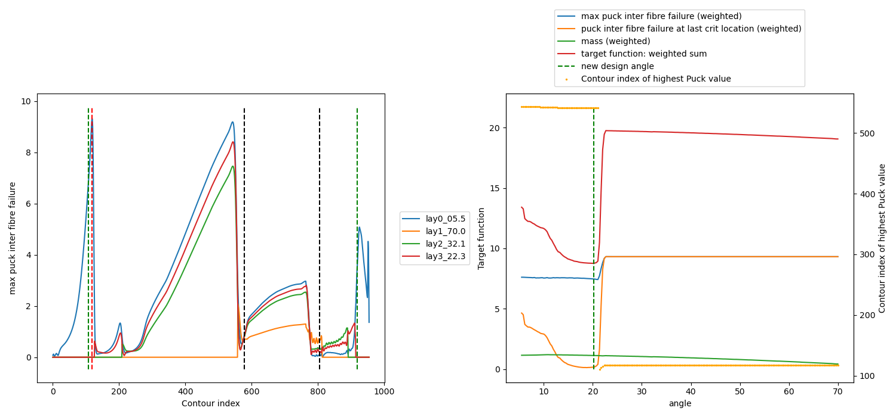
4 layers done: $\omega_{V1} = [1,1,1,0.1]$
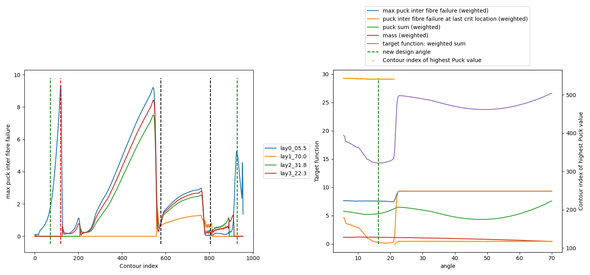
4 layers done: $\omega_{V2} = [1,0.5,2,0.1]$
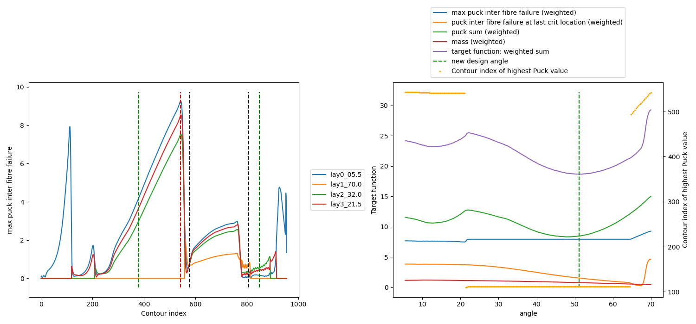

### Iteration 5
Same observation as in previous iteration

5 layers done: $\omega_{old} = [1,1,0,0.1]$
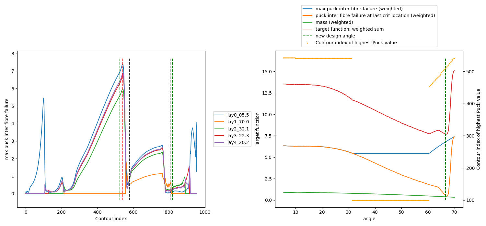
5 layers done: $\omega_{V1} = [1,1,1,0.1]$
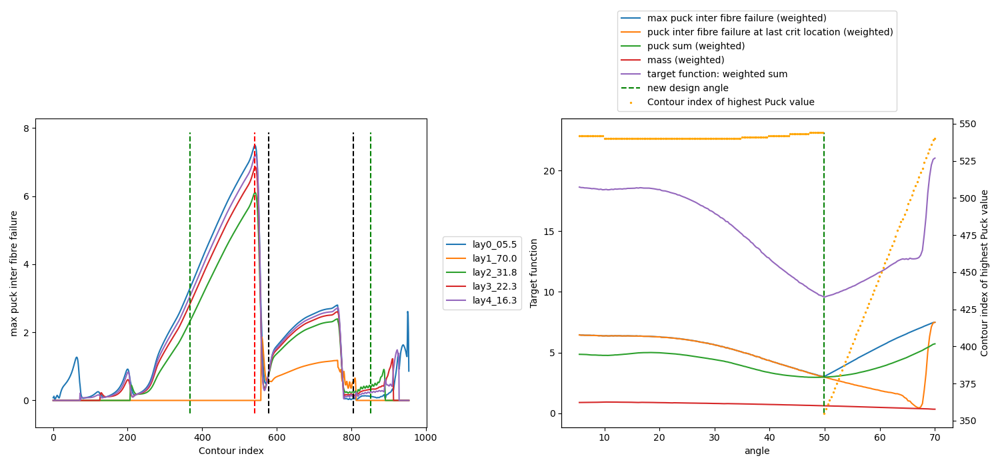
5 layers done: $\omega_{V2} = [1,0.5,2,0.1]$
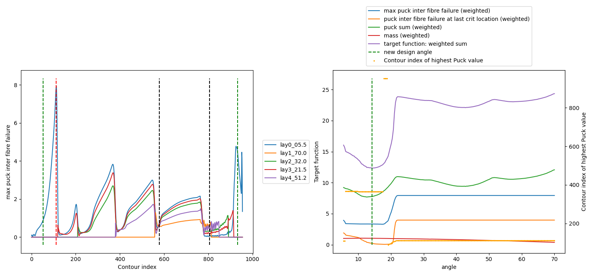

### Final result 
**number of layers**
- old version (see above chapter) $\omega_{old} = [1,1,0,0.1]$ : 16
- new version $\omega_{V1} = [1,1,1,0.1]$: 12
- new version $\omega_{V2} = [1,0.5,2,0.1]$: 12

**puck**
The version with $\omega_{V2} = [1,0.5,2,0.1]$ lead to slightly smaller $max(puck)$ than 
$\omega_{V2} = [1,1,1,0.1]$. Having more emphasis on $sum(puck)$ and less on $max(Puck(crit index))$
is more beneficial because $sum(puck)$ has much less variation between min and max than 
$max(Puck(crit index))$.

12 layers done: $\omega_{V1} = [1,1,1,0.1]$
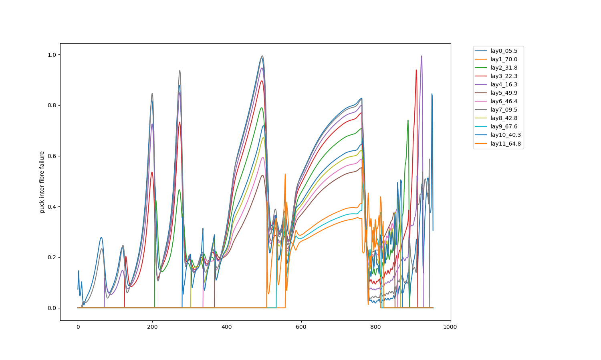
12 layers done: $\omega_{V2} = [1,0.5,2,0.1]$

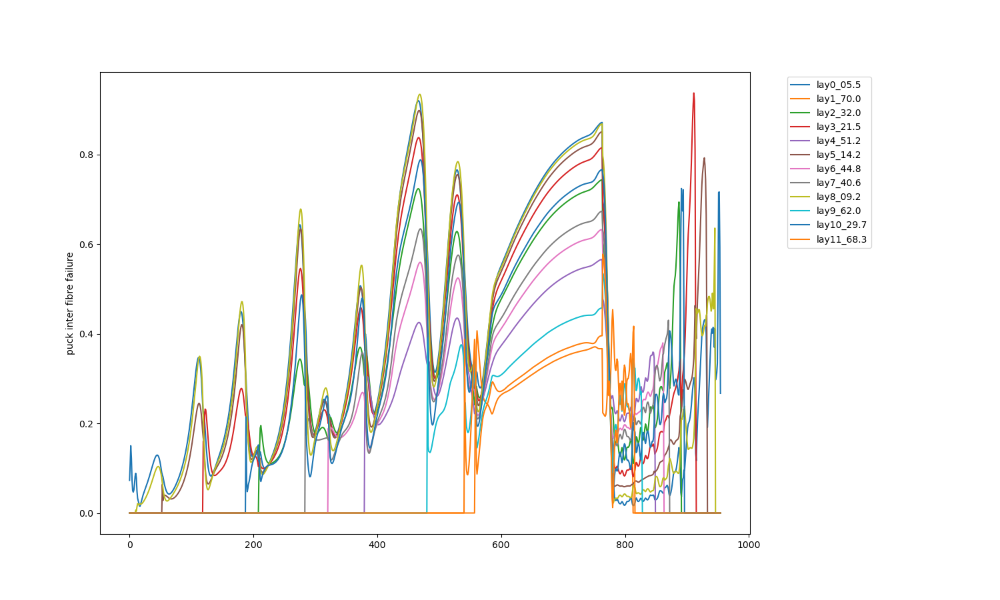

